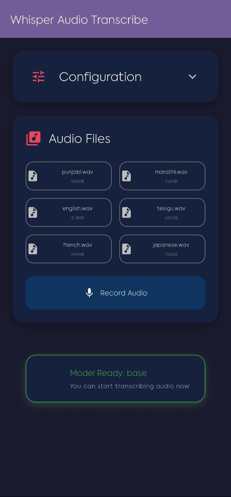
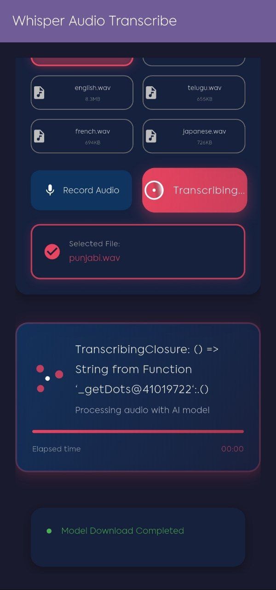
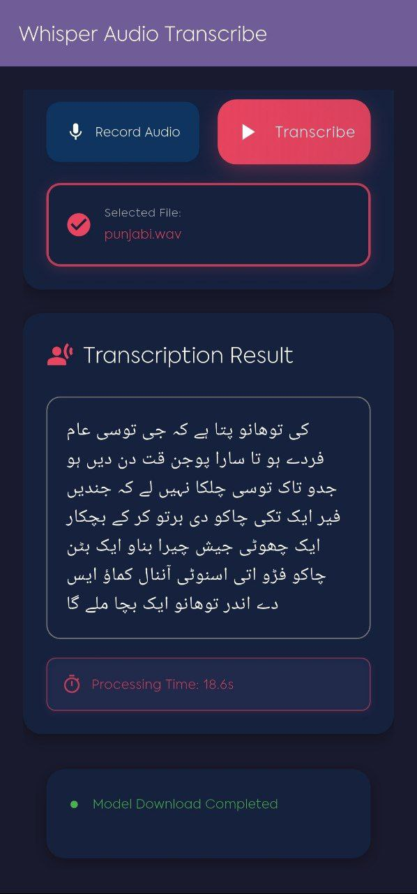
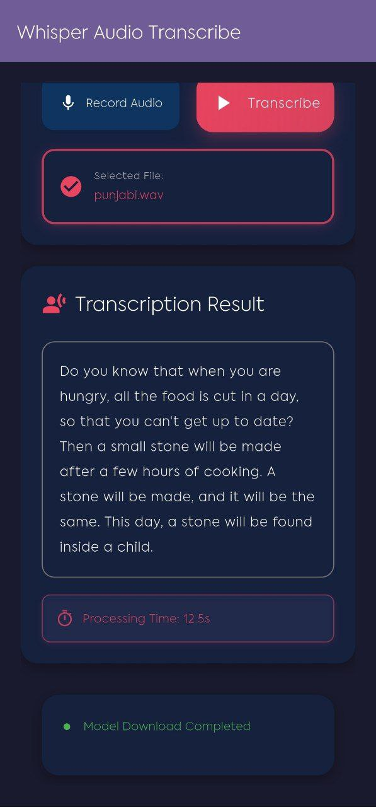
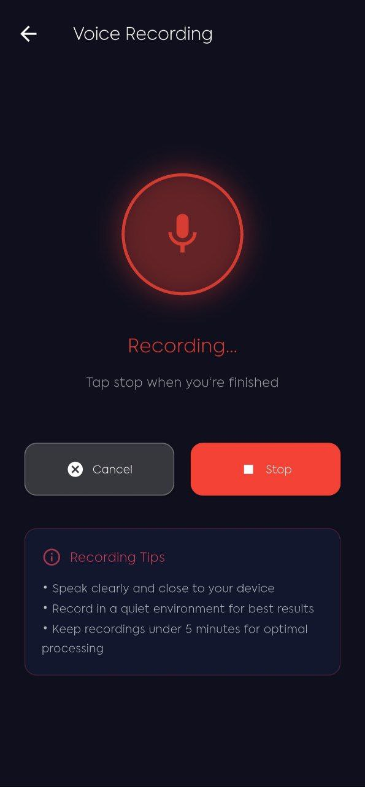
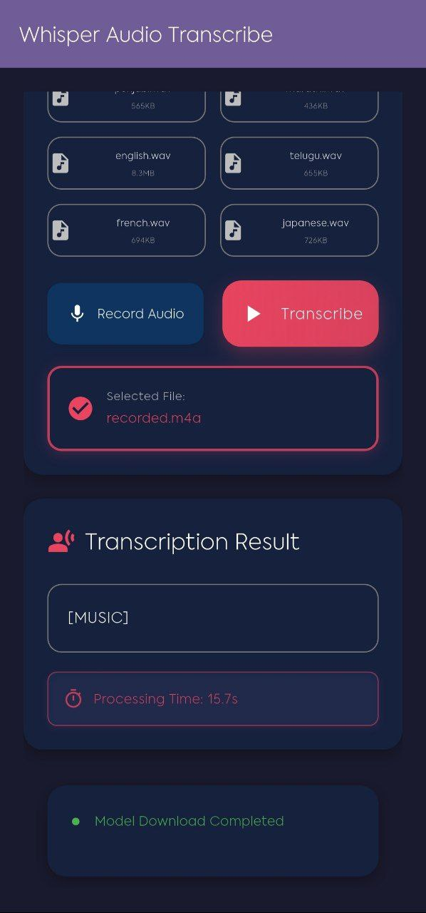
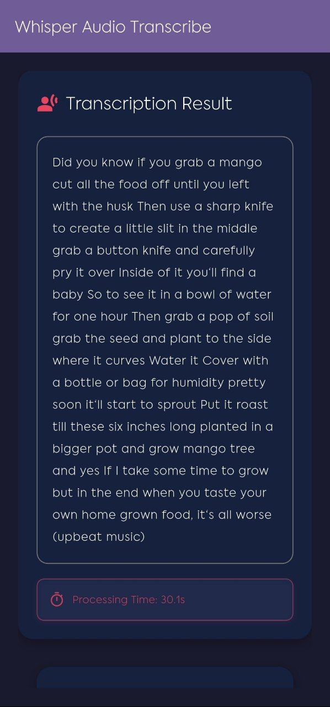

# Whisper Kit (Android Only)

A Flutter plugin that brings OpenAI's Whisper ASR (Automatic Speech Recognition) capabilities natively into your Android app. It supports offline speech-to-text transcription using Whisper models directly on the device.

---

## Features

- **Audio File Transcription**: Transcribe WAV audio files to text using OpenAI's Whisper models
- **Multiple Whisper Models**: Support for various Whisper model sizes (Tiny, Base, Small, Medium)
- **Automatic Model Management**: Models are automatically downloaded when needed, with optional progress tracking
- **Android Focused**: Thoroughly tested and confirmed to be working seamlessly on Android devices
- **Offline Functionality**: No need for external APIs or cloud services – all processing happens directly on the device
- **Native Integration**: Efficiently integrates the native `whisper.cpp` library for optimal performance
- **Language Support**: Automatic language detection and translation to English
- **Timestamped Segments**: Get transcription with precise timestamp information for each segment

---

## Installation

1. **Add the dependency**:

    Open your `pubspec.yaml` file and add the following line under `dependencies`:

    ```yaml
    whisper_kit: ^latest_version  # Replace with the latest version (current 0.1.0)
    ```

2. **Get the packages**:

    Run the following command in your terminal within your Flutter project directory:

    ```bash
    flutter pub get
    ```

3. **Android Configuration**:

    Ensure your Android project has the necessary permissions and configuration:

    Add these permissions to your `android/app/src/main/AndroidManifest.xml`:

    ```xml
    <uses-permission android:name="android.permission.RECORD_AUDIO" />
    <uses-permission android:name="android.permission.INTERNET" />
    <uses-permission android:name="android.permission.WRITE_EXTERNAL_STORAGE" />
    ```

4. **Ensure CMake and NDK Support (Android)**:

    Make sure your Android project is configured to use CMake and the Android NDK. Flutter projects typically include this setup by default. If you encounter build issues related to native code, refer to the Flutter documentation on adding native code to your project.

---

## Platform Support

| Platform | Status     |
|----------|------------|
| Android  | Working    |
| iOS      | Planned    |
| Web      | Not yet    |

---

## Getting Started

### 1. Import the Package

In your Dart code, import the `whisper_kit` library:

```dart
import 'package:whisper_kit/whisper_kit.dart';
```

### 2. Basic Usage Example

Here's a comprehensive example of how to use the Whisper Kit for transcription:

#### Audio File Transcription

```dart
import 'package:whisper_kit/whisper_kit.dart';

class TranscriptionExample {
  Future<void> transcribeAudioFile() async {
    final String audioPath = '/path/to/your/audio.wav';

    // Create a Whisper instance with your preferred model
    final Whisper whisper = Whisper(
      model: WhisperModel.base,
      // Optional: custom download host (defaults to HuggingFace)
      downloadHost: 'https://huggingface.co/ggerganov/whisper.cpp/resolve/main',
    );

    // Create a transcription request
    final TranscribeRequest request = TranscribeRequest(
      audio: audioPath,
      language: 'auto', // 'auto' for detection, or specify: 'en', 'es', 'fr', etc.
    );

    try {
      final WhisperTranscribeResponse result = await whisper.transcribe(
        transcribeRequest: request,
      );
      print('Transcription: ${result.text}');
      
      // Access segments if available
      if (result.segments != null) {
        for (final segment in result.segments!) {
          print('[${segment.fromTs} - ${segment.toTs}]: ${segment.text}');
        }
      }
    } catch (e) {
      print('Error during transcription: $e');
    }
  }
}
```

#### Transcription with Translation

```dart
import 'package:whisper_kit/whisper_kit.dart';

class TranslationExample {
  Future<void> transcribeAndTranslate() async {
    final Whisper whisper = Whisper(model: WhisperModel.small);

    // Enable translation to English
    final TranscribeRequest request = TranscribeRequest(
      audio: '/path/to/foreign_language_audio.wav',
      isTranslate: true, // Translates to English
      language: 'auto',  // Auto-detect source language
    );

    try {
      final WhisperTranscribeResponse result = await whisper.transcribe(
        transcribeRequest: request,
      );
      print('Translated text: ${result.text}');
    } catch (e) {
      print('Error: $e');
    }
  }
}
```

#### Model Download with Progress Tracking

```dart
import 'package:whisper_kit/whisper_kit.dart';
import 'package:whisper_kit/download_model.dart';

class ModelManager {
  Future<void> downloadModelWithProgress() async {
    try {
      await downloadModel(
        model: WhisperModel.base,
        destinationPath: '/path/to/model/directory',
        onProgress: (int received, int total) {
          final progress = (received / total * 100).toStringAsFixed(1);
          print('Download progress: $progress%');
        },
      );
      print('Model downloaded successfully!');
    } catch (e) {
      print('Error downloading model: $e');
    }
  }
}
```

> **Note:** The `Whisper` class automatically downloads the model if it doesn't exist locally when you call `transcribe()`. Manual download is only needed if you want progress tracking during download.

### 3. Advanced Configuration

```dart
import 'package:whisper_kit/whisper_kit.dart';

class AdvancedTranscription {
  Future<void> transcribeWithCustomSettings() async {
    final Whisper whisper = Whisper(
      model: WhisperModel.small,
      // Optional: specify custom model storage directory
      modelDir: '/custom/path/to/models',
    );

    final TranscribeRequest request = TranscribeRequest(
      audio: '/path/to/audio.wav',
      language: 'en',           // Specify language or 'auto' for detection
      isTranslate: false,       // Set to true to translate to English
      isNoTimestamps: false,    // Set to true to skip segment timestamps
      splitOnWord: true,        // Split segments on word boundaries
      threads: 4,               // Number of threads to use
      nProcessors: 2,           // Number of processors to use
      isVerbose: true,          // Enable verbose output
    );

    try {
      final WhisperTranscribeResponse result = await whisper.transcribe(
        transcribeRequest: request,
      );

      print('Transcription: ${result.text}');
      
      // Process segments with timestamps
      if (result.segments != null) {
        for (final segment in result.segments!) {
          print('${segment.fromTs} -> ${segment.toTs}: ${segment.text}');
        }
      }
    } catch (e) {
      print('Error: $e');
    }
  }

  Future<void> getWhisperVersion() async {
    final Whisper whisper = Whisper(model: WhisperModel.none);
    final String? version = await whisper.getVersion();
    print('Whisper version: $version');
  }
}

---

## Screenshots

<div align="center">

### Recording Interface
| Recording Screen | Configuration Options | Model Download Progress |
|:---:|:---:|:---:|
|  |  |  |

### Transcription Results
| Result Display | Model Download |
|:---:|:---:|
|  |  |

### Additional Features
| Audio Management | Status Indicators |
|:---:|:---:|
|  |  |

| Progress Widgets | Processing Display |
|:---:|:---:|
|  |  |

| Main Interface |
|:---:|
|  |

</div>

---

## API Reference

### Core Classes

#### `Whisper`
The main class for transcription operations:

```dart
const Whisper({
  required WhisperModel model,  // Required: the model to use
  String? modelDir,             // Optional: custom model storage directory
  String? downloadHost,         // Optional: custom model download URL
  Function(int, int)? onDownloadProgress,  // Optional: download progress callback
});
```

**Methods:**
- `Future<WhisperTranscribeResponse> transcribe({required TranscribeRequest transcribeRequest})` - Transcribe audio file
- `Future<String?> getVersion()` - Get the Whisper library version

#### `TranscribeRequest`
Configuration for a transcription request:

```dart
factory TranscribeRequest({
  required String audio,        // Path to audio file (WAV format recommended)
  bool isTranslate = false,     // Translate to English
  int threads = 6,              // Number of threads
  bool isVerbose = false,       // Verbose output
  String language = 'auto',     // Language code or 'auto' for detection
  bool isSpecialTokens = false, // Include special tokens
  bool isNoTimestamps = false,  // Skip timestamp generation
  int nProcessors = 1,          // Number of processors
  bool splitOnWord = false,     // Split on word boundaries
  bool noFallback = false,      // Disable fallback
  bool diarize = false,         // Enable speaker diarization
  bool speedUp = false,         // Speed up processing
});
```

#### `WhisperTranscribeResponse`
The transcription result:

- `String text` - The transcribed text
- `List<WhisperTranscribeSegment>? segments` - Timestamped segments (if timestamps enabled)

#### `WhisperTranscribeSegment`
A segment of the transcription with timestamps:

- `Duration fromTs` - Start timestamp
- `Duration toTs` - End timestamp
- `String text` - The segment text

#### `WhisperModel`
Enum for available model sizes:

- `WhisperModel.none` - No model (for version check only)
- `WhisperModel.tiny` - Fastest, least accurate (~75MB)
- `WhisperModel.base` - Good balance (~142MB)
- `WhisperModel.small` - Better accuracy (~466MB)
- `WhisperModel.medium` - Best accuracy (~1.5GB)

#### `downloadModel` Function
Standalone function to download models with progress tracking:

```dart
Future<void> downloadModel({
  required WhisperModel model,
  required String destinationPath,
  String? downloadHost,
  Function(int received, int total)? onProgress,
});
```

---

## Audio Requirements

### Supported Formats
- **WAV files** (recommended): 16kHz, mono, 16-bit PCM
- **Other formats**: May require conversion before processing

### Audio Quality Tips
- Use a quiet environment for best results
- Speak clearly at a normal pace
- Ensure proper microphone placement
- Audio should be at least 1 second long for optimal transcription

---

## Error Handling

Common errors and their solutions:

```dart
final Whisper whisper = Whisper(model: WhisperModel.base);
final TranscribeRequest request = TranscribeRequest(audio: audioPath);

try {
  final result = await whisper.transcribe(transcribeRequest: request);
  print('Transcription: ${result.text}');
} catch (e) {
  if (e.toString().contains('Model')) {
    print('Model error. The model may need to be downloaded.');
  } else if (e.toString().contains('audio') || e.toString().contains('Audio')) {
    print('Audio format error. Please ensure the audio is in WAV format (16kHz, mono, 16-bit PCM).');
  } else {
    print('Transcription failed: $e');
  }
}
```

> **Tip:** The library throws generic `Exception` objects with descriptive messages. Check the exception message to determine the type of error.

---

## Performance Considerations

- **Model Size**: Larger models provide better accuracy but require more processing time and memory
- **Device Requirements**: Minimum 4GB RAM recommended for smooth operation
- **Battery Usage**: Continuous transcription can be battery-intensive
- **Storage**: Ensure sufficient space for downloaded models (75MB - 1.5GB per model)

---

## Project Structure

├── lib/
│   └── whisper_kit.dart           # Dart wrapper and plugin interface
├── src/
│   ├── main.cpp                   # Native C++ bindings
├── android/
│   ├── build.gradle
│   ├── src/main/
│   │   └── java/com/example/whisper_kit/   # Android JNI bridge
│   │   └── cpp/                   # Compiled native library output
│   ├── CMakeLists.txt
├── example/
│   ├── lib/main.dart             # Sample Flutter usage project
├── .gitignore
└── README.md

---

## Contributing

Contributions are welcome! Please feel free to submit a Pull Request. For major changes, please open an issue first to discuss what you would like to change.

### Development Setup

1. Clone the repository
2. Run `flutter pub get` in the root directory
3. Navigate to the example app: `cd example`
4. Run the example: `flutter run`

---

## License

This project is licensed under the MIT License - see the LICENSE file for details.

---

## Acknowledgments

- [OpenAI Whisper](https://github.com/openai/whisper) for the original speech recognition model
- [whisper.cpp](https://github.com/ggerganov/whisper.cpp) for the efficient C++ implementation
- Flutter community for feedback and support